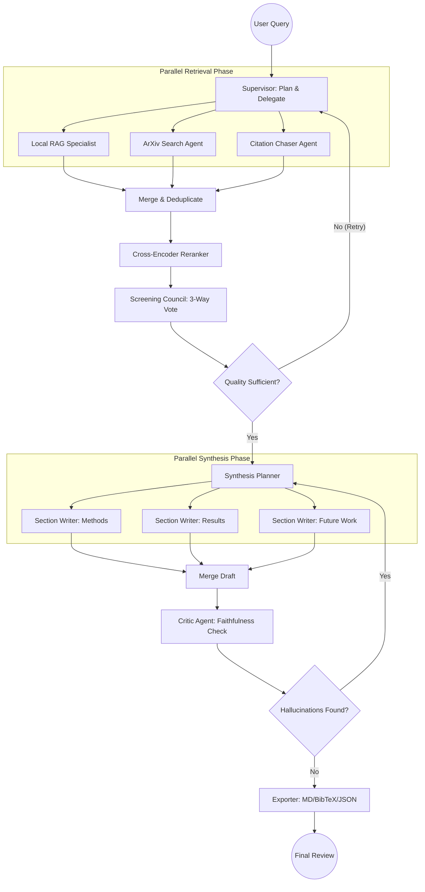

# 🧠 Multi-Agent Orchestration: "The Research Council"

This document details the advanced multi-agent architecture designed for the Systematic Literature Review (SLR) system. It moves beyond a linear chain into a dynamic, autonomous research workflow.

---

## 🏛️ System Architecture

The core of this architecture is a **Supervisor/Orchestrator** model. Instead of a hardcoded sequence, a central planner delegates tasks to specialized sub-agents, manages parallel execution paths, and evaluates quality before proceeding.

### High-Level Graph Structure

---

## 🤖 Agent Specializations

| Agent | Role | Capability |
|---|---|---|
| **Supervisor** | **The Brain** | Decomposes query into sub-topics; sets minimum paper thresholds; determines if retrieval loops are necessary. |
| **Search Council** | **The Explorers** | Local RAG (vectors), Web Search (ArXiv/Semantic Scholar), and Citation Chasers (backwards chaining). |
| **Recency Screener** | **Quality Control** | Strict filter for publication dates and source credibility. |
| **Method Screener** | **Quality Control** | Filters for papers that specifically answer "how" something is done, not just theoretical mentions. |
| **Section Writers** | **The Specialists** | Domain-specific LLM prompts focused purely on one aspect (e.g., just metrics or just methodology) to avoid context dilution. |
| **The Critic** | **The Auditor** | Performs cross-referencing between the generated synthesis and the original retrieved text chunks to ensure 0% hallucination rate. |

---

## 🔄 Advanced Logic Flows

### 1. The Voting Mechanism
Unlike a single filter, the **Screening Council** runs 3 different prompts in parallel. A retrieval chunk is only accepted if it passes the "Relevance," "Methodological Rigor," and "Recency" checks. This significantly reduces noise in the final synthesis.

### 2. The Feedback Loop
If the **Critic Agent** identifies a claim in the draft that isn't explicitly supported by the `[ID]` citations provided, it sends the draft back to the **Section Writers** with specific instructions: *"Claim 'X' is unsupported. Either find the evidence in Document [ID] or remove the claim."*

### 3. State Management (`AgentState`)
The global state tracks more than just documents:
- `research_plan`: The decomposition of the query.
- `screening_votes`: Audit trail of why papers were kept or rejected.
- `critic_issues`: List of unsupported claims for the revision phase.
- `retrieval_attempts`: Counter to prevent infinite loops in the search phase.

---

## 🛠️ Implementation Strategy
This architecture is implemented using **LangGraph**, utilizing:
- **Parallel Edges**: For the fan-out retrieval and synthesis phases.
- **Conditional Edges**: For the Quality Gate and Critic revision loops.
- **Interrupts**: For human-in-the-loop validation after the screening phase but before the generation phase.

Part 2: Real Multi-Agent Orchestration (Not Just a Chain)
You're absolutely right — the current system is a single sequential chain masquerading as multi-agent. Every "agent" just runs one after the other with no branching, parallelism, specialization, or autonomy. Here's what genuine multi-agent orchestration looks like for this domain:

🏛️ Proposed Architecture: "The Research Council"
The core idea: a Supervisor/Orchestrator agent that delegates to a pool of specialized sub-agents, with feedback loops, parallel execution, and conditional routing.

┌─────────────────────────────────┐
                        │         SUPERVISOR AGENT         │
                        │  (Plans, delegates, evaluates)   │
                        └──────────────┬──────────────────┘
                                       │
              ┌──────────┬─────────────┼──────────────┬──────────┐
              │          │             │              │          │
              ▼          ▼             ▼              ▼          ▼
        ┌──────────┐ ┌────────┐ ┌──────────────┐ ┌────────┐ ┌────────────┐
        │ QUERY    │ │ WEB    │ │  RETRIEVAL   │ │CRITIC  │ │ FORMATTER  │
        │ PLANNER  │ │SEARCH  │ │  SPECIALIST  │ │ AGENT  │ │   AGENT    │
        │  AGENT   │ │ AGENT  │ │  (per query) │ │        │ │            │
        └──────────┘ └────────┘ └──────────────┘ └────────┘ └────────────┘
Workflow with Real Multi-Agent Complexity
User Query: "Machine unlearning in federated learning"
       │
       ▼
┌─────────────────────────────────────────────────────────────┐
│  NODE 1: SUPERVISOR AGENT (Orchestrator)                    │
│  - Decomposes the query into sub-topics                     │
│  - Creates a research PLAN (JSON):                          │
│    { "subtopics": ["exact unlearning", "approx unlearning", │
│                    "FL privacy", "verification methods"]    │
│      "strategy": "parallel_retrieval_then_merge"           │
│      "depth": "comprehensive" }                            │
│  - Decides which agents to activate                         │
└────────────────────────┬────────────────────────────────────┘
                         │
        ┌────────────────┼────────────────────┐
        │ PARALLEL SPAWN │                    │
        ▼                ▼                    ▼
┌───────────────┐ ┌──────────────┐  ┌────────────────────┐
│ NODE 2a:      │ │ NODE 2b:     │  │ NODE 2c:           │
│ LOCAL RETRIEVAL│ │ WEB SEARCH  │  │ CITATION CHASER    │
│ AGENT          │ │ AGENT       │  │ AGENT              │
│ (per subtopic) │ │ (ArXiv API) │  │ (fetches papers    │
│ Runs 4 parallel│ │ Searches    │  │  that are CITED BY │
│ retrievals     │ │ ArXiv for   │  │  already retrieved │
│ in MapReduce   │ │ each topic) │  │  papers — backward │
│ style          │ │             │  │  citation chain)   │
└───────┬───────┘ └──────┬───────┘  └────────┬───────────┘
        │                │                   │
        └────────────────┴───────────────────┘
                         │  (all results merged)
                         ▼
┌─────────────────────────────────────────────────────────────┐
│  NODE 3: DEDUP + RANKING AGENT                              │
│  - Cross-deduplicates all results (by semantic hash)        │
│  - Re-ranks combined pool using cross-encoder               │
└───────────────────────────────────────────────────────────-─┘
                         │
                         ▼
┌─────────────────────────────────────────────────────────────┐
│  NODE 4: SCREENING COUNCIL (3 parallel Screener agents)     │
│  Each screener evaluates a different aspect:                │
│  - Screener A: Methodological relevance                     │
│  - Screener B: Recency & novelty (year > 2019?)             │
│  - Screener C: Empirical validity (has experiments?)        │
│  VOTING: A paper is kept if ≥ 2/3 screeners approve        │
└─────────────────────────────────────────────────────────────┘
                         │
                         ▼
┌─────────────────────────────────────────────────────────────┐
│  NODE 5: SUPERVISOR EVALUATION (Conditional Routing)        │
│  - Checks: "Do we have enough high-quality docs?"           │
│  - IF papers < threshold → LOOP BACK to Node 2 with        │
│    refined search strategy (max 3 retries)                  │
│  - IF papers >= threshold → PROCEED to synthesis           │
└─────────────────────────────────────────────────────────────┘
                         │
           ┌─────────────┼──────────────┐
           │ PARALLEL    │              │
           ▼             ▼              ▼
┌──────────────┐ ┌─────────────┐ ┌───────────────┐
│ NODE 6a:     │ │ NODE 6b:    │ │ NODE 6c:      │
│ SECTION      │ │ SECTION     │ │ SECTION       │
│ WRITER A     │ │ WRITER B    │ │ WRITER C      │
│ "Methods"    │ │ "Results &  │ │ "Challenges & │
│ section only │ │  Metrics"   │ │  Future Work" │
└──────┬───────┘ └──────┬──────┘ └──────┬────────┘
       │                │               │
       └────────────────┴───────────────┘
                        │
                        ▼
┌─────────────────────────────────────────────────────────────┐
│  NODE 7: CRITIC / HALLUCINATION CHECKER AGENT               │
│  - Reads the combined draft review                          │
│  - Checks EVERY claim against the source chunks            │
│  - Returns: {issues: [{claim, unsupported_reason}]}        │
│  - IF issues found → routes to REVISION AGENT (loop)       │
│  - IF clean → routes to FORMATTER                          │
└─────────────────────────────────────────────────────────────┘
                         │
                         ▼
┌─────────────────────────────────────────────────────────────┐
│  NODE 8: FORMATTER AGENT                                    │
│  - Exports Markdown, BibTeX, JSON structured report        │
│  - Generates a PRISMA flow diagram (papers in/out counts)  │
└─────────────────────────────────────────────────────────────┘
🧩 The LangGraph State for This Architecture
python
class AgentState(TypedDict):
    # Input
    query: str
    research_plan: dict              # from Supervisor
    # Parallel retrieval results
    local_docs: List[dict]           # from Local Retrieval Agent
    web_docs: List[dict]             # from Web Search Agent
    cited_docs: List[dict]           # from Citation Chaser Agent
    merged_docs: List[dict]          # after dedup + rerank
    # Screening (multi-vote)
    screening_votes: List[dict]      # [{doc_id, votes: 3/3}]
    screened_docs: List[dict]        # final kept docs
    # Retry control
    retrieval_attempts: int          # loop counter
    quality_sufficient: bool         # supervisor gate
    # Parallel synthesis
    section_methods: str
    section_results: str
    section_challenges: str
    draft_review: str
    # QA
    critic_issues: List[dict]        # from Critic Agent
    revision_count: int              # loop counter
    # Output
    final_review: str
    bibtex: str
    prisma_counts: dict
🔀 Key Multi-Agent Patterns Introduced
Pattern	Where Used	Why It Matters
Parallel fan-out / MapReduce	Node 2 (3 retrieval agents in parallel)	3x faster retrieval; broader coverage
Voting / Ensemble	Node 4 (3 screeners vote)	Reduces single-LLM bias in relevance decisions
Conditional loop / retry	Supervisor → Node 2	Self-correcting; handles sparse knowledge bases
Parallel section writers	Node 6	Each agent is an expert in one domain section
Critic → Revision loop	Node 7 → draft writer	Hallucination reduction via self-critique
Supervisor / Orchestrator	Node 1, Node 5	Central planner with dynamic routing (not hardcoded)
Specialized tool agents	Web Search, Citation Chaser	Each agent has its own tools, not just prompts
🛠️ LangGraph-Specific Implementation Notes
python
# Conditional routing example for the retry loop
def supervisor_gate(state: AgentState) -> str:
    if len(state["screened_docs"]) < 5 and state["retrieval_attempts"] < 3:
        return "retry_retrieval"   # → loops back to Node 2
    else:
        return "proceed_to_synthesis"  # → goes to Node 6
workflow.add_conditional_edges(
    "supervisor_gate",
    supervisor_gate,
    {
        "retry_retrieval": "retrieve",
        "proceed_to_synthesis": "section_writer_methods"
    }
)
# Parallel synthesis with fan-out
workflow.add_node("section_writer_methods", write_methods_section)
workflow.add_node("section_writer_results", write_results_section)
workflow.add_node("section_writer_challenges", write_challenges_section)
# All 3 start from "screened_docs" and write to different state keys
# Then a "merge_sections" node combines them